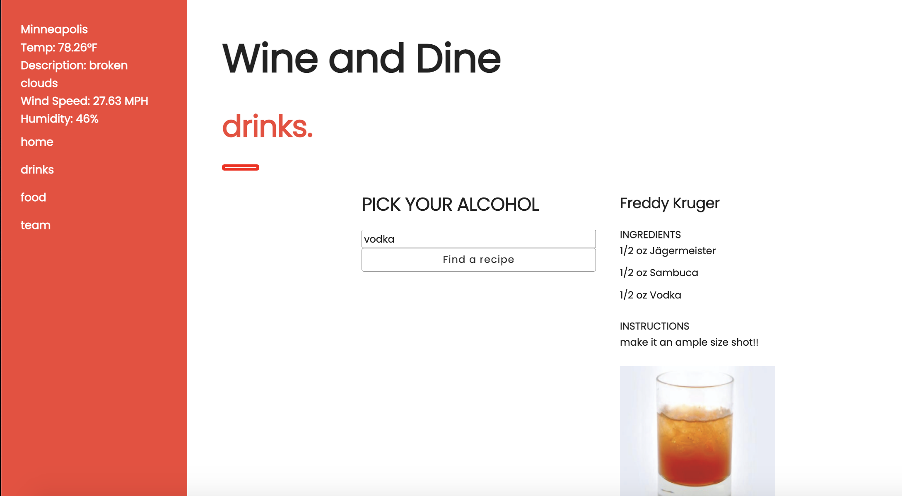

# Wine & Dine

## Description
Problem: Users need to understand what ingredients they need to make beverages and appetizers. They also need to know how to make the beverages and entrees.

Solution: A web application that allows users to select an alcohol type (vodka, rum, tequila, gin, etc.) and based on their selection they will see a recipe. The user can also select a protein and find a recipe according to their selection.

## How to use it
### Find your cocktail recipe
1. Search for your alochol type 
2. Click "FIND A RECIPE" to find a recipe for your preferred alcohol
   
### Find your food recipe
1. Search for your protein type
2. Click "FIND A RECIPE" to find a recipe for your preferred protein

## User Story
**AS** A user
**I WANT** to see 1 cocktail recipe based on the beverage type I select and 1 food 
recipe based on what selection I make for my protein
**SO THAT** I know how to make a drink/recipe and what ingredients I need

## Acceptance Criteria:
**AS** A user
**I WANT** to be able to select a protein and alcohol
**SO THAT** I know how to make a drink/entree and understand what ingredients I need

## Wireframes (Web & Mobile): 

## Screenshot

## APIs Used
- https://www.thecocktaildb.com/
- https://www.themealdb.com/

## CSS Framework Used
- http://getskeleton.com/

## Link
https://triciaax.github.io/Wine-and-Dine/